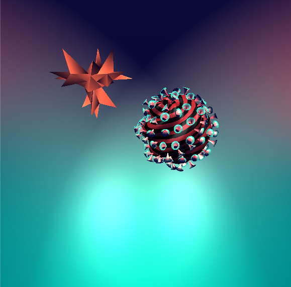

# cg20-3

## BME Számítógépes grafika 3. házi feladat - Vírusölő antitest:
Készítsen „antitest vírust öl” játékot, amely egy textúrázott gömb vagy henger belsejében zajlik, amit pont fényforrások világítanak meg. A vírus teste haragosan hullámzó gömb, a nyúlványok Tractricoid alakzatok, amelyek a hullámzó felületre mindig merőlegesek. A nyúlványok egyenletesen fedik be a felületet. A gömb és a nyúlványok textúrázottak diffúz/spekuláris típusúak. A vírus a saját tengelye körül forog állandó szögsebességgel, ezen kívül a testén kívüli pivot pont körül is, amit a [cos(t), sin(t/2), sin(t/3), sin(t/5)] (vigyázat nem normalizált!) kvaternió ad meg (t az idő sec-ben). Az antitest tetraéder Helge von Koch típusú felosztással két szinten. Az antitest tüskéinek nyújtogatásával kelt félelmet. Az antitest saját tengelye körül forog és Brown mozgással halad előre, az x, X, y, Y, z, Z billentyűket lenyomva tartva a haladás az adott (kisbetű: pozitív, nagybetű: negatív) irányba valószínűbb. A Brown mozgás sebességvektora véletlenszerű és 0.1 sec-ként változik. Ha az antitest alaptetraéderének befoglaló gömbje és az alapállatú vírus gömbje ütközik, a vírus elpusztul, azaz mozgása megszűnik.
                                                                                                  feladat: Szirmay-Kalos László

